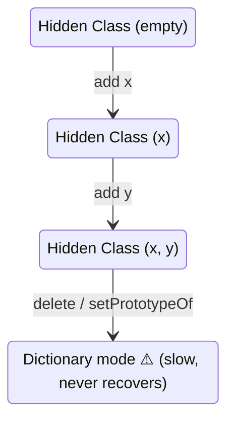
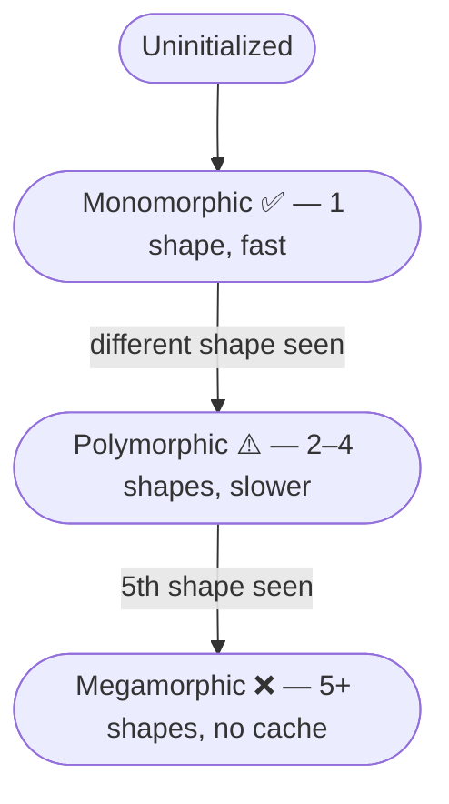
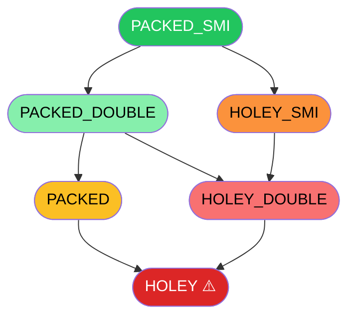
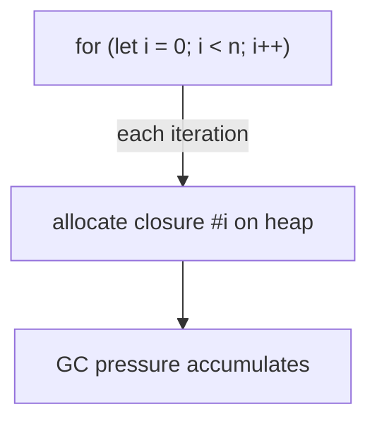
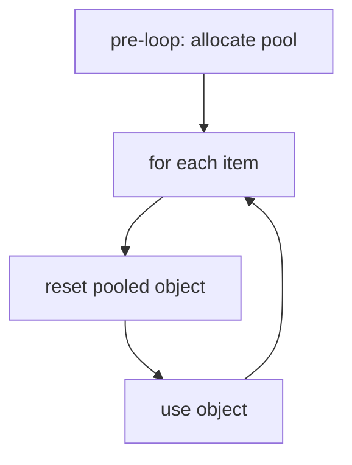

# Rules

Detailed explanations for every rule in `eslint-plugin-extreme-node`, grouped by the V8 mechanism they protect.

---

## Object Shape & Hidden Classes

V8 represents an object's shape as a **hidden class** (also called a *map*). Every object starts life on a hidden class and, as properties are added, V8 transitions to a new hidden class that extends the previous one. The key insight is that two objects created the same way share the same hidden class — which lets V8 cache property lookups and optimise code that handles them.



---

### `xn/no-delete` — error

Using `delete obj.prop` tears the object out of its current hidden class and may push it into **dictionary mode** — a hash-map-backed representation that loses all fast-property optimisations permanently.

```js
// ❌ shatters hidden class
delete session.userId;

// ✅ keep the shape, null the value
session.userId = null;
```

---

### `xn/class-transition` — error

V8 builds a hidden class for an object at construction time. Adding a new property to `this` **outside the constructor** causes a transition to a new hidden class, forking the IC chain and polluting any call site that has seen this object.

```js
// ❌ hidden class transition on every enrich() call
class Event {
  constructor() { this.type = null; }
  enrich() { this.extra = {}; }   // new property — new hidden class
}

// ✅ declare all properties up front, even as null/0/false
class Event {
  constructor() {
    this.type  = null;
    this.extra = null;
  }
  enrich() { this.extra = {}; }   // assignment, no transition
}
```

---

### `xn/prefer-class` — warn

Factory functions that always return the same object literal shape *look* stable, but V8 does not guarantee a shared hidden class across call sites for plain object literals. A `class` guarantees a single hidden class for all instances.

The rule triggers when a function has exactly one return path and it returns an object literal with ≥ 2 properties (configurable via `minProperties`).

```js
// ❌ may produce different hidden classes at different call sites
function makeEvent() {
  return { type: null, ts: 0, userId: null };
}

// ✅ single hidden class, always
class Event {
  constructor() {
    this.type   = null;
    this.ts     = 0;
    this.userId = null;
  }
}
```

**Option:**
```json
{ "xn/prefer-class": ["warn", { "minProperties": 3 }] }
```

---

### `xn/no-proto-mutation` — error

Changing an object's prototype at runtime is the most destructive operation for V8 optimisation. It invalidates every inline cache that has ever observed the object, can trigger a global deoptimisation of every function that touched it, and prevents the object from ever reaching a stable map state again.

> **When this is actually fine:** setting a prototype once during application startup — before any hot code has run — is essentially zero-cost. V8 hasn't built any ICs around the object yet, so there is nothing to invalidate. The danger is mutating a prototype on an object that has already passed through hot code paths. If your codebase does intentional startup-time proto setup, disable this rule for those specific lines with `// eslint-disable-next-line xn/no-proto-mutation`.

```js
// ❌ nuclear option mid-flight — invalidates all ICs that have seen obj
Object.setPrototypeOf(obj, newProto);
obj.__proto__ = newProto;

// ✅ set the prototype at construction time
class Derived extends Base {}
const obj = Object.create(proto);
```

---

## Inline Caches & Deopts

An **inline cache (IC)** is a small per-call-site cache that records the type/shape of values seen. Monomorphic ICs (one shape) are fastest. Polymorphic ICs (2–4 shapes) are slower. Megamorphic ICs (5+ shapes) bypass the cache entirely.



---

### `xn/ic-poly` — warn

Detects call sites within a file that pass objects of different shapes to the same function, driving the IC into polymorphic or megamorphic state.

```js
// ❌ process() sees two different shapes — polymorphic IC
process(new MouseEvent());
process(new KeyEvent());

// ✅ unify under a single shape
process(new Event('mouse'));
process(new Event('key'));
```

> **Note:** this is a static heuristic — cross-file flow and variable-tracked shapes require runtime profiling (`--trace-ic`, [deoptigate](https://github.com/thlorenz/deoptigate)).

---

### `xn/deopt` — warn

Flags patterns that permanently prevent TurboFan from fully optimising a function, or that force a runtime deoptimisation bail-out.

| Pattern | Why it hurts |
|---|---|
| `arguments` | Forces heap allocation per call, disables some register opts |
| `eval` / `new Function` | Black box to V8; kills scope and type analysis |
| `for...in` | Slow enumeration path; V8 cannot optimise key iteration |
| `with` | Disables all scope optimisations in the enclosing function |
| Parameter reassignment | Prevents certain V8 register and type optimisations |

```js
// ❌
function sum() { return arguments[0] + arguments[1]; }
eval('x + 1');
for (const k in obj) { use(k); }
with (obj) { x = 1; }
function fn(a) { a = a || 0; }

// ✅
function sum(...args) { return args[0] + args[1]; }
// no eval
for (const k of Object.keys(obj)) { use(k); }
// no with
function fn(a) { const val = a || 0; }
```

---

### `xn/no-arguments` — warn

The `arguments` object is a legacy array-like that V8 must materialise on the heap on every call to any non-arrow function that references it. It also forces V8 to treat the parameter list as "arguments-aliased", disabling certain register optimisations and some TurboFan inlining decisions.

```js
// ❌
function log() {
  for (let i = 0; i < arguments.length; i++) console.log(arguments[i]);
}

// ✅ rest params are a plain Array — no special treatment
function log(...args) {
  for (const a of args) console.log(a);
}
```

---

## Arrays & Element Kinds

V8 tracks the **element kind** of every array on a one-way downgrade lattice. Once downgraded, an array never recovers — even if you remove the problematic elements later.



PACKED_SMI is fastest (integers, no holes). Every step right or down is a permanent performance downgrade: V8 must check for holes on each element access and may walk the prototype chain for missing indices.

---

### `xn/no-sparse-array` — error

Sparse array literals (`[1,,3]`) start immediately in **HOLEY** mode — there is no way to recover.

```js
// ❌ starts as HOLEY_SMI
const a = [1,,3];

// ✅
const a = [1, undefined, 3];
```

---

### `xn/array-type-consistency` — warn

Mixing numbers with any non-numeric value (strings, booleans, objects) forces the array into **PACKED_ELEMENTS** — the slowest non-holey kind — from the moment it is created.

> **Note:** `"use strict"` does not affect this. Strict mode is about syntax safety and runtime semantics — the elements kind lattice is a V8 internal optimisation that runs independently of strict mode.

```js
// ❌ PACKED_ELEMENTS
const mixed = [1, 'two', 3];
const flags = [1, true, 3];

// ✅ PACKED_SMI or PACKED_DOUBLE
const nums = [1, 2, 3];
const strs = ['a', 'b', 'c'];
```

---

### `xn/prefer-typed-array` — warn

Plain JavaScript arrays of numbers are still heap-allocated objects with GC overhead and V8 boxing on each element. TypedArrays store numbers as **contiguous unboxed memory** — no pointer chasing, no GC overhead on the numeric data, cache-friendly for SIMD-style access.

```js
// ❌ heap-allocated, GC'd, boxed
const coords = [1.0, 2.5, 3.14];
const buf    = new Array(1024);

// ✅ unboxed contiguous memory
const coords = new Float64Array([1.0, 2.5, 3.14]);
const buf    = new Float64Array(1024);
```

---

### `xn/no-array-hole` — error

Three patterns introduce holes into arrays at runtime, permanently downgrading their element kind to HOLEY:

```js
// ❌ leaves a hole at index i
delete arr[i];

// ❌ extending .length introduces uninitialised (holey) slots
arr.length = arr.length + 10;

// ❌ pre-sized array — all slots are holes until filled
const a = new Array(100);

// ✅
arr[i] = null;                          // no hole
const a = new Array(100).fill(null);    // packed immediately
const b = new Float64Array(100);        // TypedArray, no holes possible
```

---

## Memory & GC

### `xn/no-closure-in-loop` — warn

Each iteration of a loop that creates a function allocates a **new closure object** on the V8 heap. In hot loops this generates sustained GC pressure and prevents TurboFan from keeping the loop variable in a register.



```js
// ❌ n closures allocated
for (let i = 0; i < n; i++) {
  const fn = () => process(i);
  queue.push(fn);
}

// ✅ one function, referenced n times
const process = (i) => doWork(i);
for (let i = 0; i < n; i++) {
  queue.push(() => process(i));   // still a closure, but hoisted logic
}

// ✅ best — hoist entirely
function handler(i) { return doWork(i); }
for (let i = 0; i < n; i++) queue.push(handler.bind(null, i));
```

IIFEs inside loops are intentional scope-isolation patterns and are **not flagged**.

---

### `xn/no-object-in-loop` — warn

Allocating a new object (via `new` or a literal `{}`) on every iteration adds an object to the V8 heap that must eventually be collected. In tight loops this can trigger minor (scavenger) or even major GC pauses at the worst possible time. The fix is **object pooling**: allocate once before the loop and reset state each iteration.



```js
// ❌ allocates on every iteration
for (let i = 0; i < n; i++) {
  const evt = new Event();
  dispatch(evt);
}

// ✅ object pooling
const evt = new Event();
for (let i = 0; i < n; i++) {
  evt.reset();
  dispatch(evt);
}
```

TypedArray construction inside loops is **not flagged** — TypedArrays do not have GC overhead on their numeric data.
